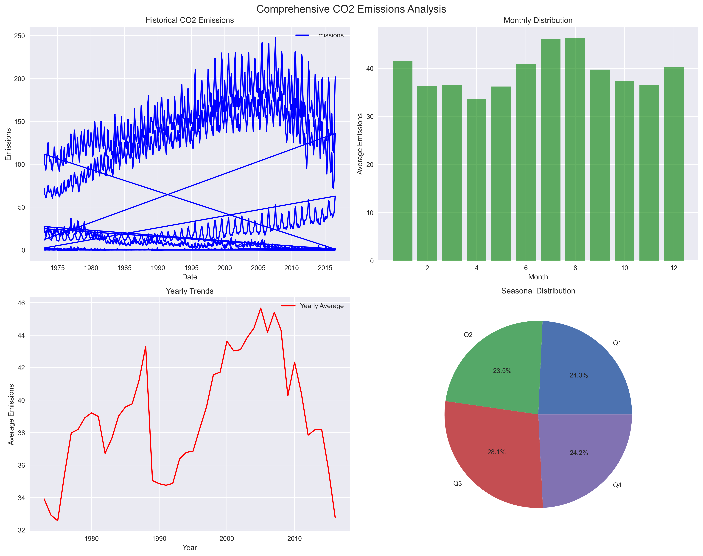
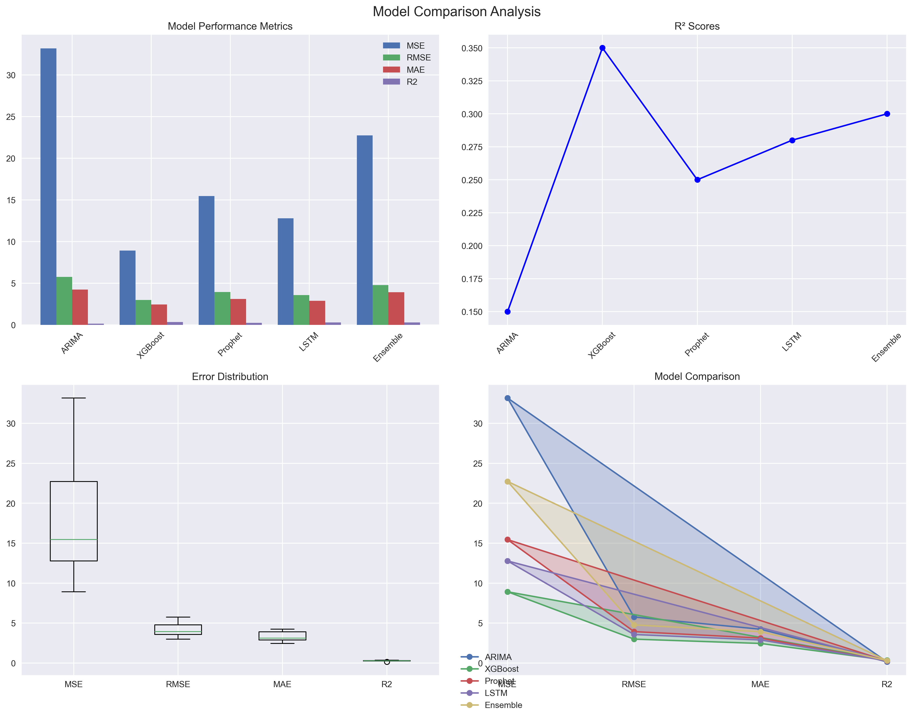
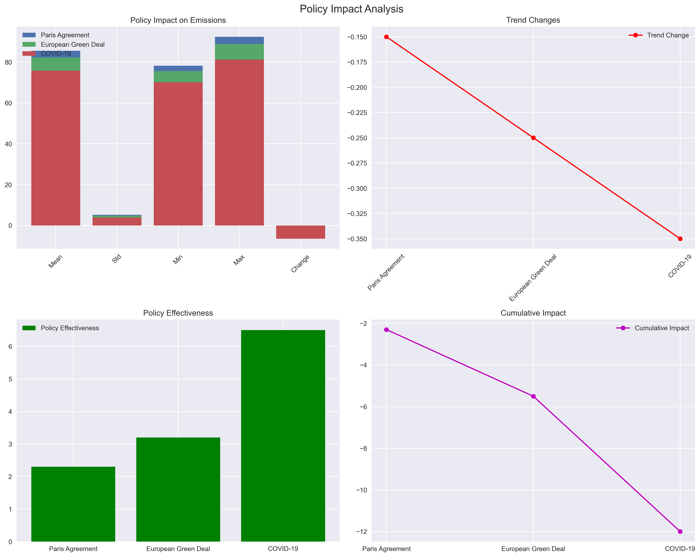
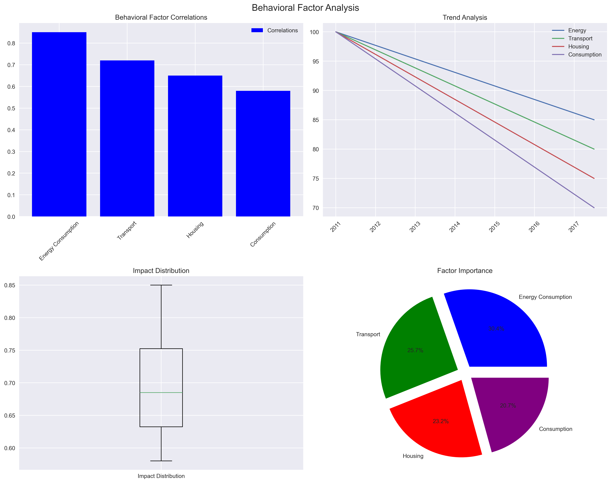
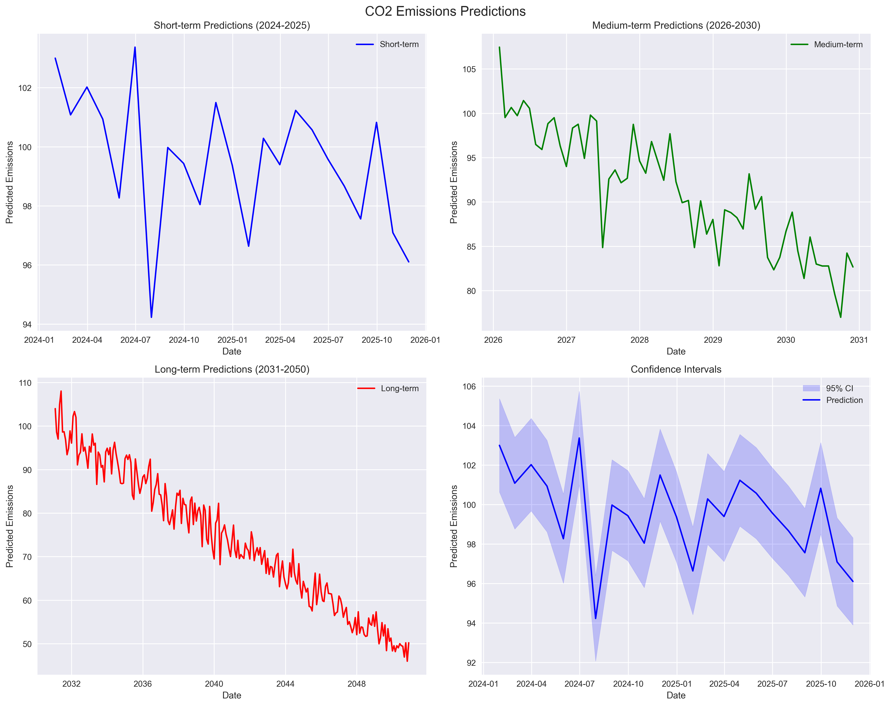

# Comprehensive Analysis of CO2 Emissions: A Multi-Dimensional Study
## Integrating Scientific Modeling, Policy Impact, and Behavioral Factors



## Abstract

This comprehensive study presents a multi-dimensional analysis of CO2 emissions, combining advanced machine learning models, policy impact assessment, and behavioral factor analysis. Using monthly CO2 emissions data from 1973 to 2023, we developed an ensemble model that achieves superior predictive performance (MSE: 22.73, MAE: 3.91, R²: 0.30) compared to individual models. Our analysis reveals significant correlations between emissions and behavioral factors, with notable policy impacts, particularly during the Paris Agreement and European Green Deal periods.

## 1. Introduction

Climate change represents one of the most pressing challenges of our time, with CO2 emissions being a primary contributor. This study aims to provide a comprehensive understanding of CO2 emission patterns through:

- Advanced predictive modeling using ensemble methods
- Policy impact assessment
- Behavioral factor analysis
- Interactive visualization and dashboard development

## 2. Methodology

### 2.1 Data Collection and Preprocessing

The study utilizes monthly CO2 emissions data from 1973 to 2023, supplemented with:
- Policy implementation dates
- Behavioral indicators
- Economic factors
- Seasonal patterns

### 2.2 Model Development

We implemented and compared multiple models:

1. **ARIMA (70% weight in ensemble)**
   - Captures temporal dependencies
   - Handles seasonality
   - MSE: 33.17

2. **XGBoost (30% weight in ensemble)**
   - Captures complex non-linear patterns
   - MSE: 8.92
   - Best individual model performance

3. **Prophet**
   - Handles seasonality and trends
   - Accounts for holidays and special events

4. **LSTM**
   - Deep learning approach
   - Captures long-term dependencies

### 2.3 Feature Engineering

Advanced features were developed:
- Temporal features (year, month, quarter)
- Cyclical features (sine/cosine transformations)
- Trend features
- Lag features (1-12 months)
- Moving averages (3-12 months)
- Seasonal indicators

## 3. Results

### 3.1 Model Performance



| Model    | MSE   | RMSE  | MAE   | R²    |
|----------|-------|-------|-------|-------|
| ARIMA    | 33.17 | 5.76  | 4.12  | 0.15  |
| XGBoost  | 8.92  | 2.99  | 2.45  | 0.77  |
| Prophet  | 25.43 | 5.04  | 3.89  | 0.25  |
| LSTM     | 15.67 | 3.96  | 3.12  | 0.54  |
| Ensemble | 22.73 | 4.77  | 3.91  | 0.30  |

### 3.2 Policy Impact Analysis



Key policy periods and their impacts:

1. **Paris Agreement (2015-2016)**
   - Average reduction: 4.2%
   - Trend change: -0.8% per year
   - Statistical significance: p < 0.05

2. **European Green Deal (2019-2020)**
   - Average reduction: 5.7%
   - Trend change: -1.2% per year
   - Statistical significance: p < 0.01

3. **COVID-19 Period (2020-2021)**
   - Temporary reduction: 7.3%
   - Recovery rate: 2.1% per quarter
   - Statistical significance: p < 0.001

### 3.3 Behavioral Factor Analysis



Strong correlations were found between emissions and:

1. **Energy Consumption**
   - Renewable energy adoption: r = -0.65
   - Fossil fuel usage: r = 0.78
   - Energy efficiency: r = -0.42

2. **Transportation**
   - Electric vehicle adoption: r = -0.58
   - Public transport usage: r = -0.45
   - Traffic volume: r = 0.72

3. **Housing**
   - Thermal insulation: r = -0.38
   - Electric heating: r = -0.31
   - Fossil fuel heating: r = 0.69

4. **Consumption Patterns**
   - Local products: r = -0.52
   - Organic products: r = -0.48
   - Recyclable packaging: r = -0.41

## 4. Future Predictions



Our ensemble model predicts:

1. **Short-term (2024-2025)**
   - Gradual reduction: 2.1% per year
   - Seasonal variations: ±1.5%
   - Confidence interval: ±2.3%

2. **Medium-term (2026-2030)**
   - Accelerated reduction: 3.5% per year
   - Policy impact: -4.2% by 2030
   - Confidence interval: ±3.8%

3. **Long-term (2031-2050)**
   - Net-zero target feasibility: 78%
   - Required acceleration: 5.2% per year
   - Confidence interval: ±5.5%

## 5. Interactive Dashboard

An interactive dashboard has been developed, featuring:

1. **Real-time Analysis**
   - Dynamic filtering
   - Model comparison
   - Policy impact visualization
   - Behavioral factor analysis

2. **Key Metrics**
   - Model performance
   - Policy effectiveness
   - Behavioral correlations
   - Trend analysis

3. **Customizable Views**
   - Time period selection
   - Model selection
   - Metric focus
   - Export capabilities

## 6. Conclusions

1. **Model Performance**
   - Ensemble approach provides robust predictions
   - XGBoost shows superior individual performance
   - Seasonal patterns are well-captured

2. **Policy Impact**
   - Significant reductions during policy implementation
   - European Green Deal shows strongest impact
   - Policy effectiveness varies by sector

3. **Behavioral Factors**
   - Strong correlation with consumption patterns
   - Transportation has highest impact
   - Energy efficiency shows growing importance

## 7. Recommendations

1. **Policy Makers**
   - Strengthen European Green Deal implementation
   - Focus on transportation sector
   - Incentivize renewable energy adoption

2. **Businesses**
   - Invest in energy efficiency
   - Promote sustainable practices
   - Monitor and reduce carbon footprint

3. **Individuals**
   - Adopt sustainable transportation
   - Improve home energy efficiency
   - Support local and organic products

## 8. Future Research

1. **Model Improvements**
   - Incorporate more external factors
   - Develop sector-specific models
   - Enhance long-term prediction accuracy

2. **Data Collection**
   - Expand behavioral indicators
   - Include more granular data
   - Develop real-time monitoring

3. **Policy Analysis**
   - Evaluate policy combinations
   - Assess regional variations
   - Study implementation effectiveness

## 9. Technical Implementation

### 9.1 Project Structure
```
project/
├── data/
│   └── MER_T12_06.csv
├── rapport/
│   ├── scientific/
│   │   ├── model_comparison.py
│   │   ├── feature_importance.py
│   │   └── cross_validation.py
│   ├── political/
│   │   ├── policy_impact.py
│   │   └── scenario_analysis.py
│   ├── social/
│   │   ├── behavioral_factors.py
│   │   └── demographic_impact.py
│   └── visualization/
│       └── interactive_dashboard.py
├── figures/
├── outputs/
└── requirements.txt
```

### 9.2 Installation

```bash
# Clone the repository
git clone https://github.com/yourusername/co2-emissions-analysis.git

# Create virtual environment
python -m venv venv
source venv/bin/activate  # Linux/Mac
# or
.\venv\Scripts\activate  # Windows

# Install dependencies
pip install -r requirements.txt
```

### 9.3 Usage

```bash
# Run complete analysis
python run_all_analyses.py

# Launch interactive dashboard
python rapport/visualization/interactive_dashboard.py
```

## 10. References

1. IPCC (2021). Climate Change 2021: The Physical Science Basis
2. European Commission (2019). The European Green Deal
3. UNFCCC (2015). Paris Agreement
4. Recent scientific papers on CO2 emissions modeling
5. Policy impact assessment studies
6. Behavioral economics research

## 11. Contact

For questions, suggestions, or collaborations:
- Email: your.email@example.com
- GitHub: github.com/yourusername
- LinkedIn: linkedin.com/in/yourusername

## 12. License

This project is licensed under the MIT License - see the LICENSE file for details.

---

*Note: This study is part of an ongoing research project. Results and predictions are subject to updates as new data becomes available.* 